# 🤖 Agentes Autónomos - CloudCamp

Repositorio de proyectos de agentes conversacionales de IA para educación en computación en la nube, desarrollados por CloudCamp.

## 📋 Descripción General

Este repositorio contiene dos implementaciones diferentes de sistemas de tutoría inteligente que simulan conversaciones entre estudiantes y profesores sobre computación en la nube:

1. **Azure AI Foundry**: Implementación usando Azure AI Foundry y Semantic Kernel
2. **AWS Strand Agents**: Implementación usando Strands AI Framework

Ambos proyectos demuestran cómo crear agentes conversacionales que mantienen contexto y proporcionan experiencias educativas interactivas.

## 🚀 Proyectos

### 1. 🔵 Azure AI Foundry

**Tecnologías**: Azure AI Foundry, Semantic Kernel, Python

Sistema de conversación que utiliza Azure AI Foundry para crear agentes que conversan sobre computación en la nube.

#### Características:
- ✅ Agentes CloudStudent y CloudProfessor
- ✅ Integración con Azure OpenAI
- ✅ Estrategia de terminación automática
- ✅ Gestión de credenciales con DefaultAzureCredential
- ✅ Chat grupal con Semantic Kernel

### 2. 🟠 AWS Strand Agents

**Tecnologías**: Strands AI Framework, Python, ModelSelector

Sistema avanzado de tutoría con múltiples agentes especializados y herramientas.

#### Características:
- ✅ Sistema de orquestación con múltiples herramientas
- ✅ Agentes especializados (Support, DevOps, SAA Simulator, Laboratory)
- ✅ Conversación entre CloudStudent y CloudProfessor
- ✅ Manejo robusto de errores con SafeAgent
- ✅ Cleanup automático de recursos
- ✅ Interfaz visual mejorada

```mermaid
graph LR
    subgraph "ğŸ—ï¸ Sistema de Tutoría Inteligente"
        subgraph "🭠Agentes"
            A1[📠CloudStudent<br/>Alex]
            A2[👨â€ğŸ« CloudProfessor<br/>Dr. González]
        end
        
        subgraph "ğŸ›ï¸ Gestión"
            CM[ConversationManager]
            SA1[SafeAgent Wrapper]
            SA2[SafeAgent Wrapper]
        end
        
        subgraph "🧠 Modelo IA"
            MS[ModelSelector<br/>Sonnet3.7]
            API[API Endpoint]
        end
        
        subgraph "💾 Datos"
            CH[Conversation History]
            CTX[Context Buffer]
        end
    end
    
    A1 -.-> SA1
    A2 -.-> SA2
    SA1 --> CM
    SA2 --> CM
    CM --> CH
    CM --> CTX
    SA1 --> MS
    SA2 --> MS
    MS --> API
    
    style A1 fill:#e3f2fd
    style A2 fill:#f3e5f5
    style CM fill:#fff3e0
    style MS fill:#e8f5e8
```

